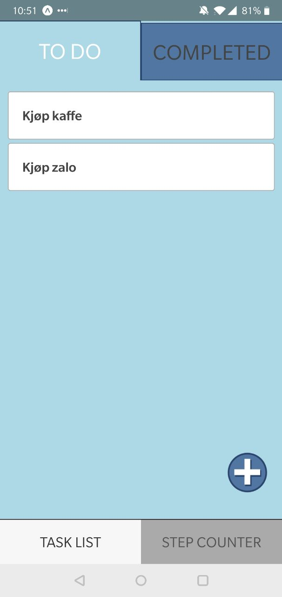
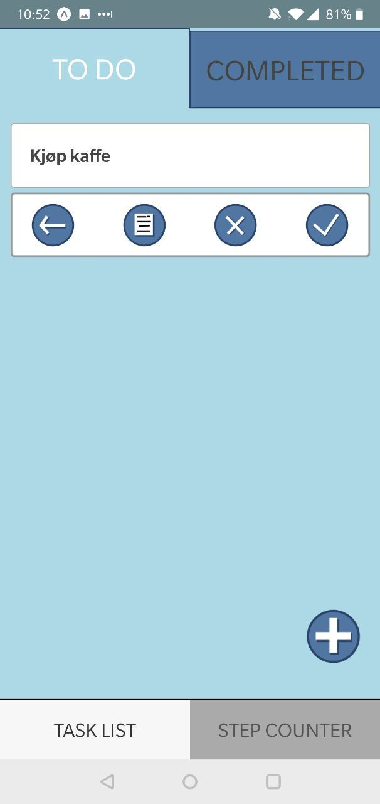
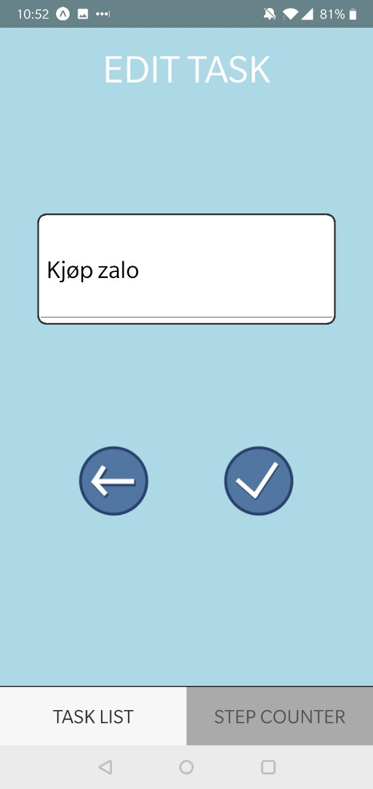
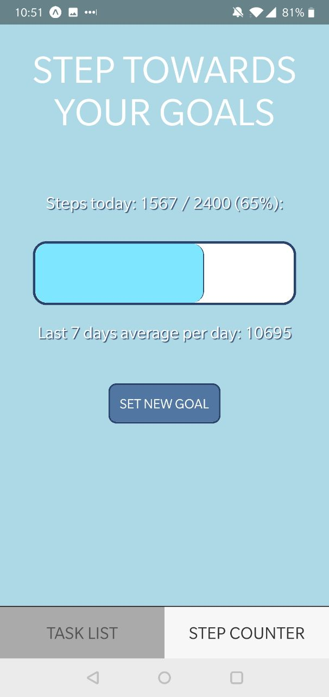
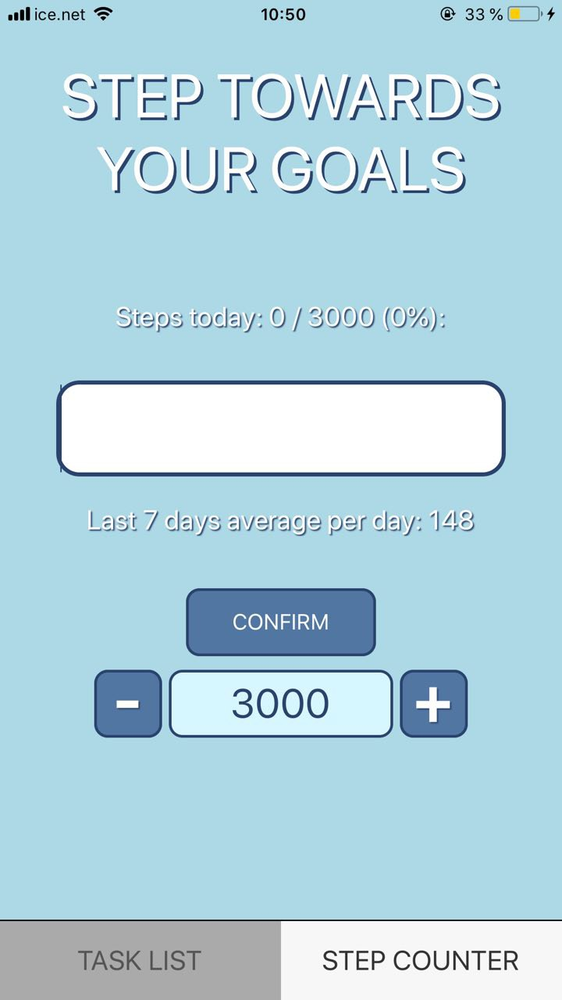

# Dokumentasjon

I dette prosjektet har det blitt laget en "to do"-app hvor brukeren kan definere egne oppgaver han vil gjøre, i tillegg til å ha en skritteller med mål for antall skritt han går.
Appen er skrevet i React Native med bruk av Expo og fungerer på både iOS og Android. Expo 2.2.0 og Node 6.4.1 ble brukt. Under er det skjermbilder av de forskjellige skjermene appen har (på en Android-telefon), og en sammenligning av hvordan skrittellerskjermen ser ut på iOS.

Tasks To Do | Task options | Edit task | Step counter | Step counter on iOS
:-:|:-:|:-:|:-:|:-:
 |   |  |  | 

## Komponentstruktur

Toppkomponenten er `App.js`, som bestemmer hvilke av de tre subkomponentene som skal rendres (`HomeScreen`, `EditTaskScreen` og `PedometerSensor`).
Dette gjøres med state'en `displayedScreen`.

Hjemskjermen består så av en av to subkomponenter, `TasksToDo.js` eller `TasksCompleted.js`, avhengig av state `displayedTab`.
Hver av disse subkomponentene består begge av `Task.js`-komponenter, der state `isCompleted` bestemmer om den gitte oppgaven skal rendres som fullført eller ikke.

`EditTaskScreen.js` er skjermen som rendres hvis en ny oppave skal legges til eller en eksisterende oppgave skal oppdateres.
Denne består ikke av noen subkomponenter.

`PedoSensor.js` er skjermen for skritteller-funksjonaliteten.
Skrittelleren ble implementert ved hjelp av Expo's Pedometer API. State til dette komponentet inneholder flere variabler:
* `isPedometerAvailable`: Representerer tilgjengeligheten av pedometeret til enheten, kan være `checking`, `true` eller `false`
* `stepCount7Days`: Antall skritt gjennomført siste 7 dager, hentes asynkront når componenten abonnerer på resultat fra pedometer api'en.
* `stepGoalToday`: Lagrer daglig skrittmål, dette lastes inn når componentet mountes gjennom `_loadGoal()` og lagres når et nytt mål er satt og bekreftet gjennom `_storeGoal()`
* `stepsToday` og `steps: stepsToday` hentes ut fra pedometer apiet når komponenten mountes og er antall steg gjort siden starten av dagen. `Steps` oppdateres kontinuerlig når skrittelleren er åpen gjennom et abonnement på `Pedometer.watchStepCount()`
* `showGoalSetup`: Brukes for å bestemme i rendringen om konfigurering av mål skal vises eller ikke, settes til `true` når "Set goal" trykkes på, settes til `false` når "Confirm" trykkes på.
* `configStepGoalPending`: Mellomlagring av skritt mål, `stepGoalToday` settes lik denne når "Confirm" trykkes på.

Oversikt over flyt i komponenten:
* `componentDidMount()`:
    * Kaller `_subscribe()`, som sjekker om pedometer er tilgjengelig, abonnerer på skritt oppdateringer og henter asynkront ut steg utført siste 7 dager og siste dag.
    * Deretter kalles `_LoadGoal()` som laster inn nåværende `step-goal` fra async storage, hvis det ikke eksisterer noe mål i async storage settes målet til 1000 steg
* Komponenten er mountet:
    * Bruker `getStepPercent()` i rendringen for å oppdatere nåværende status i progress bar og tekst.
    * Hvis brukeren trykker på "Set goal" så vises konfigurasjonsknappene. Pluss og minus øker og senker nåværende mål via `onPressIncrementGoal()` og `onPressDecrementGoal()`. Når brukeren trykker på "Confirm" så lagres målet via `_storeGoal`, og `stepGoalsToday` settes lik `configStepGoalPending`. Deretter trigges en ny render siden state'en er oppdatert og ny informasjon vises på skjermen
* `componentWillUnmount()`:
    * Kaller `_unsubscribe()` som av-abonnerer på Pedometer apien

Annet:
* Skrittelleren fungerer på iOS uten noen tilleggssoftware, men på Android er brukeren nødt til å installere Google Fit for at skrittelleren skal bli tilgjengelig

## AsyncStorage

AsyncStorage er et key-value lagringssystem som gjør det enkelt å lagre ukryptert data asynkront.
Lagringssystemet er globalt tilgjengelig for hele appen, og under panseret så vil den bruke RocksDB eller
SQLite, avhengig av hva som er tilgjengelig. AsyncStorage er enkelt å bruke fordi det lar oss bruke et intuitivt
JavaScript API for å sette og hente ut gjenstander som lagres. Når vi i vår app lagrer oppgavene, trenger vi bare å sette
en ID som "key" og oppgaveobjektet som "value". Dette oppgaveobjektet blir "stringified" med JSON når det lagres.
Når vi henter ut en oppgave fra AsyncStorage så blir denne returnert som et "promise"-objekt. Årsaken til dette
er at AsyncStorage er asynkront, og vi må selv håndtere og hente ut oppgaven fra dette "promise"-objektet.
Oppgavene lagres som JSON-objekter, med en unik ID, en oppgavebeskrivelse og verdien `isCompleted` (`=true/false`). Id'en er et heltall som begynner på 0 dersom ingen oppgaver er laget tidligere og inkrementeres for hver oppgave som lages. Dette gjøres med verdien `counter`, som er strengt stigende og sørger for at to forskjellige oppgaver aldri vil få samme ID.

## Testing

Testing er gjort med `Jest` og `TestRenderer` funksjonen til `react-test-renderer`. 
Alle komponentene sjekkes med snapshot-funksjonaliteten til Jest for å sjekke at brukergrensesnittet ikke forandrer seg utilsiktet. 
Disse testene gjøres ved at UI-komponentene til appen rendres, lagres (ofte som JSON), før de sammenlignes med tidligere snapshot for å se om de matcher. 
Dersom noe er forskjellig vil testen feile. 
Hvis forandringer i brukergrensesnittet er gjort med hensikt kan snapshot'et oppdateres for å inkludere endringene.
Disse testene egner seg ikke godt under utvikling av brukergrensesnittet, men fungerer bra når brukergrensesnittet er klart og forandringer som gjøres ikke er ment å forandre det brukeren ser. 
Snapshot-testene gjøres i testfiler med samme navn som komponenten, ie. `App.test.js` tester `App.js`. 
Snapshot-testen av `App.js` passerer på Windows, men feiler på OSX. Dette ser ut til å være fordi snapshot'ene som genereres på de forskjellige operativsystemene kan være forskjellige selv om koden er helt lik. Vi har ikke funnet noen løsning på dette. 

`TestRenderer` brukes for å rendre komponenttreet inn i minnet så forskjellige sjekker kan gjøres.
Med dette testtreet kan både metoder og `states` i komponentene kalles og sjekkes.
Dette gjøres blant annet i `App.test.js` og `HomeScreen.test.js`, hvor en state sjekkes, en metode som skal påvirke den state'en kalles, før state'en sjekkes igjen for å bekrefte at den korrekte endringen er gjort. 
Dette gjentas så for alle tilgjengelige tilstander og metoder.  

Disse testene gir en total testdekning på 52%. 
Dette er ikke ideelt, men gir sørger for en minimumsdekning av appen.
Dersom arbeidet med appen skulle fortsatt i lengre tid kunne flere tester ha blitt skrevet for å øke dekningen, men med begrenset tid ble dette ikke gjort nå. Testene avslørte også at appen kan ha problemer med "memory leaks", men dette ble heller ikke fikset på grunn av tidsfristen.

Testing av AsyncStorage gjøres ved at det blir laget en "mock" av AsyncStorage. Klassen som gjør dette heter `MockStorage` og er
direkte kopiert av `mockStorage.js` gitt av bruker "free-soul" på følgende StackOverflow tråd: https://stackoverflow.com/questions/40952566/how-to-test-async-storage-with-jest. Denne `mockStorage`-klassen blir brukt i `AsyncStorage.test.js` for å teste funksjonaliteten til AsyncStorage. Måten testingen av AsyncStorage fungerer på er at
vi tester at objekter som blir satt, slettet, hentet og "cleared" fungerer måten AsyncStorage mener at det skal.

For å teste at vår funksjonalitet fungerer som det skal, ville vi ha laget en egen `AsyncStorageManager`-klasse som vil ligge oppå
funksjonaliteten til AsyncStorage som spesifikt ville satt nye task objekter, lest ut objekter, fjernet og updatert eksisterende objekter. Da kunne vi ha testet den funskjonaliteten som er spesifikk for vår app, f.eks at hvis en gitt funksjon skal lage en ny oppgave, så vil den ha en høyere ID enn de som allerede har eksistert tidligere i AsyncStorage. Vi kunne også teste at hvis en oppgave blir flyttet til "Completed" så blir tilstanden for om en oppgave er utført satt til `true`.

En annen måte vi kunne ha testet om vår funksjonalitet bruker AsyncStorage på en korrekt måte, er ved å lage tester som rendrer de ulike komponentene for så bruke funksjonene i de komponentene for å lage nye oppgaver og hente de ut. Deretter kan vi se om hvordan vi setter, henter, sletter og bruker AsyncStorage gir korrekt resultat, som om at ID'en til en ny oppgave er strengt stigende, og at rett oppgave blir slettet.
